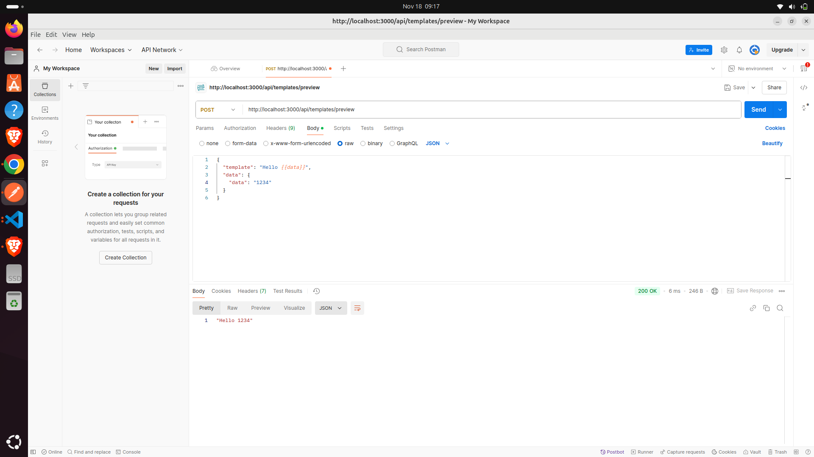

# WhatsApp Template Message Preview API

A Node.js/Express backend service for parsing and previewing WhatsApp message templates.

## Quick Start

```bash
# Install dependencies (Node.js v16+)
npm install

# Run development server
npm run dev

# Run tests
npm test

# Start production server
npm start
```

## Features
- Template parsing
- Variable replacement
- Preview generation
- Error handling
- Test coverage

## API Endpoints

### POST /api/templates/preview
Generates a preview of the WhatsApp template with provided data.

```json
// Request body
{
    "template": "Hello {{name}}, your order #{{orderNumber}} is confirmed",
    "data": {
        "name": "John",
        "orderNumber": "12345"
    }
}

// Response
{
    "message": "Hello John, your order #12345 is confirmed"
}
```

Note: Maximum 10 variables per template.

## Project Structure
```
src/
  ├── controllers/  # Request handlers
  ├── services/    # Business logic
  ├── utils/       # Helper functions
  ├── routes/      # API routes
  └── tests/       # Test files
```

## Development Setup

1. Clone the repository
2. Update environment variables if needed
3. Install dependencies: `npm install`
4. Start development server: `npm run dev`

Server runs on `http://localhost:3000` by default.

## Testing

```bash
# Run all tests
npm test

# Run specific test file
npm test template.test.js

# Watch mode
npm run test:watch
```


## Planned Improvements
- Template categories support
- Caching implementation
- Enhanced validation for WhatsApp rules
- Rate limiting
- Logging system implementation

## Contributing
Pull requests are welcome. Areas for contribution:
- Error handling
- Test coverage
- Performance optimization
- Documentation improvements